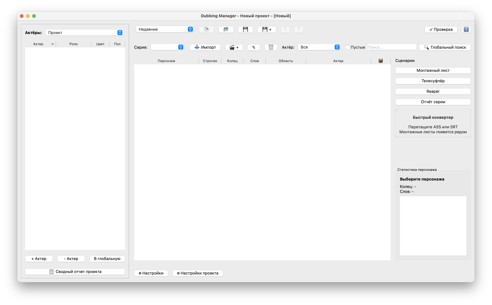

# Dubbing Manager

[](https://www.python.org/downloads/)
[](https://pypi.org/project/PySide6/)

**Dubbing Manager** — приложение для управления проектами дубляжа и озвучивания.



## ✨ Возможности

- **Управление проектами** — создание, сохранение, автосохранение, drag & drop
- **Актёрская база** — централизованная база актёров с цветовым кодированием, удалением и Undo/Redo
- **Папка проекта** — автоматический поиск и связывание файлов в папке и подпапках
- **Мониторинг файлов** — окно состояния файлов с цветовым кодированием и перепривязкой
- **Работа с эпизодами** — импорт ASS файлов, редактирование реплик, привязка видео
- **Видеоплеер** — синхронизация с репликами, переход по тайм-кодам
- **Поиск** — глобальный поиск по всем эпизодам и фильтрация по актёрам
- **Экспорт** — HTML, Excel, Reaper RPP
- **Телесуфлёр** — автопрокрутка, OSC синхронизация с Reaper
- **Аналитика** — сводные отчёты и статистика проекта
- **Глобальные настройки** — настройки экспорта, телесуфлёра и объединения реплик сохраняются между проектами
- **Отмена действий** — Undo/Redo для всех основных операций (Ctrl+Z / Ctrl+Shift+Z)


## 🚀 Быстрый старт

```bash
# Клонирование и установка
git clone <repository-url>
cd DubbingManager
python3 -m venv .venv
source .venv/bin/activate
pip install -r requirements.txt

# Запуск
python main.py
```

## 📖 Основы использования

1. **Создание проекта**: введите название и нажмите **Сохранить**
2. **Установка папки проекта**: нажмите **📁 Папка** и выберите папку с файлами
3. **Добавление актёра**: нажмите **+ Актер**, введите имя и выберите цвет
4. **Удаление актёра**: выберите актёра в таблице и нажмите **- Актер**
5. **Отмена действий**: используйте **Ctrl+Z** для отмены или **Ctrl+Shift+Z** для повтора
6. **Импорт субтитров**: выберите серию, нажмите **+ .ASS**, укажите файл (или используйте автопоиск из папки)
7. **Настройка объединения реплик**: кнопка «🔗 Настройки объединения» — параметры применяются ко всем проектам
8. **Экспорт**: настройте параметры и выберите формат (HTML/Excel/Reaper)

Подробнее в [STRUCTURE.md](STRUCTURE.md)

## 🔧 Требования

- Python 3.8+
- macOS 10.15+, Windows 10+, Linux

## 🍎 macOS: Подпись приложения

На macOS приложение требует подписи кода для корректной работы (в частности, для доступа к событиям клавиатуры и другим системным функциям).
```bash
codesign --force --deep -s - /Applications/DubbingManager.app
```

## 📋 Форматы файлов

| Тип | Расширения |
|-----|------------|
| Входные | `.ass`, `.mp4`, `.mkv`, `.mov`, `.json` |
| Выходные | `.json`, `.html`, `.xlsx`, `.rpp` |
