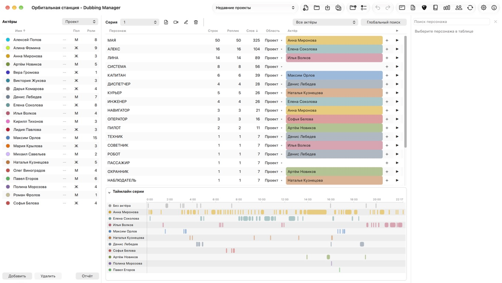
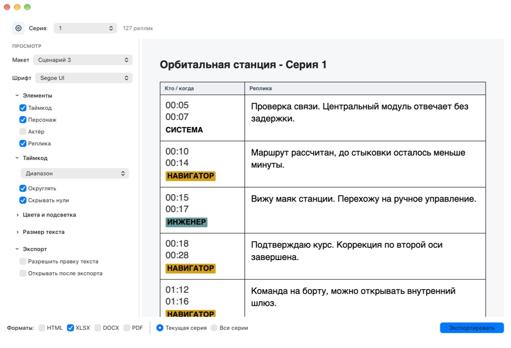
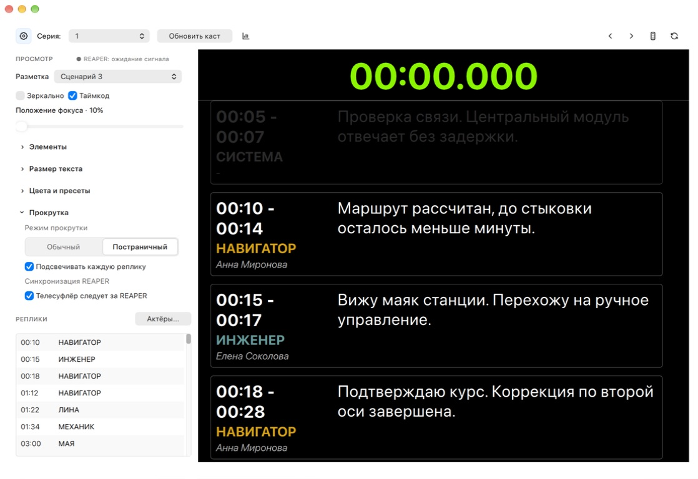
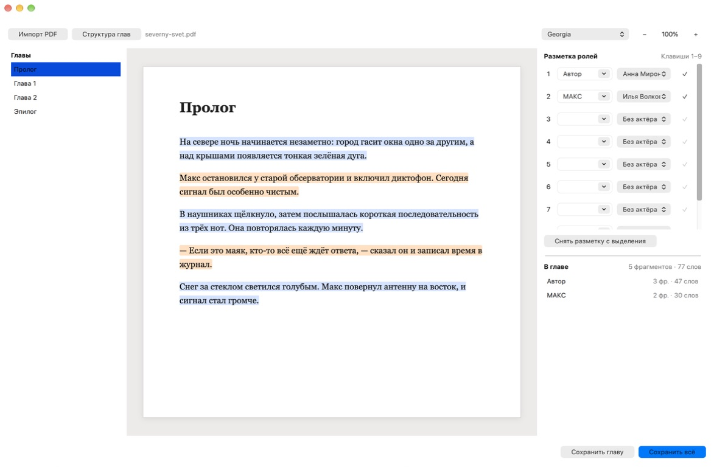

<p align="center">
  
</p>

<h1 align="center">Dubbing Manager 2.0</h1>

<p align="center">
  Рабочее пространство для подготовки дубляжа, закадрового озвучивания и аудиокниг.
</p>

<p align="center">
  <a href="https://github.com/ScrapDnB/DubbingManager/releases"><strong>Скачать</strong></a>
  ·
  <a href="#быстрый-старт">Быстрый старт</a>
  ·
  <a href="#что-нового-в-20">Что нового</a>
  ·
  <a href="#запуск-из-исходников">Для разработчиков</a>
</p>

Dubbing Manager объединяет сценарии, кастинг, тайминг, телесуфлёр, видео,
монтажные листы и экспорт в Reaper в одном проекте. Приложение рассчитано на
студии, режиссёров дубляжа, звукорежиссёров и независимые команды, которым
нужно быстро пройти путь от исходного текста до записи.



## Что нового в 2.0

Версия 2.0 — это полная переработка приложения, а не косметическое обновление.

- Новый интерфейс на Qt Quick/QML с нативным оформлением macOS и Windows.
- Самодостаточный формат проекта `.dub`: рабочие тексты и правки хранятся
  внутри проекта, а исходники остаются связанными материалами.
- Таймлайн серии с цветами актёров и быстрым обзором загруженности каста.
- Полноценные undo/redo, атомарное сохранение и настраиваемые резервные копии.
- Новый телесуфлёр с обычной и постраничной прокруткой, зеркальным режимом,
  плавающим контроллером и двусторонней синхронизацией с Reaper по OSC.
- Редактор аудиокниг: импорт текстового PDF, структура глав и цветовая разметка
  ролей прямо в тексте.
- Макеты монтажных листов, профили оформления и визуальный конструктор шаблонов.
- Переносимые пути, диагностика файлов проекта и восстановление потерянных
  связей после переезда на другой диск или компьютер.
- Быстрый конвертер ASS/SRT без создания проекта.
- Улучшенные отчёты, поиск по всем сериям и экспорт сводок для Google Sheets.

## Возможности

### Сценарии и рабочие тексты

- импорт `.ass`, `.srt` и табличных `.docx`;
- предварительная настройка колонок DOCX перед импортом;
- объединение исходных строк в реплики без потери исходного тайминга;
- встроенное редактирование реплик;
- привязка видео к серии и просмотр реплик по таймкоду;
- быстрый предпросмотр ASS/SRT перетаскиванием в главное окно.

### Кастинг

- проектная и глобальная базы актёров;
- цвет, пол и статистика ролей каждого актёра;
- назначение одного или нескольких актёров на роль;
- назначения на весь проект и переопределения для отдельной серии;
- массовое назначение ролей;
- импорт и экспорт кастинга между проектами;
- поиск ролей и просмотр их появления по сериям.

### Запись

- телесуфлёр с фильтром по актёрам;
- крупный сценарный вид и несколько макетов;
- ручная навигация, автопрокрутка и постраничный режим;
- подсветка текущей реплики и таймкод;
- зеркальный режим для аппаратных суфлёров;
- синхронизация воспроизведения и навигации с Reaper по OSC.

### Монтажные листы и экспорт

- живой предпросмотр перед экспортом;
- табличные и сценарные макеты;
- настройка колонок, шрифтов, таймкода и цветовой подсветки;
- экспорт одной серии или всего проекта;
- HTML, XLSX, DOCX и PDF;
- проекты Reaper `.rpp` с регионами и треками актёров;
- маркеры Reaper в `.csv`;
- отчёты по серии и сводка по всему проекту.

### Аудиокниги

- импорт PDF с текстовым слоем;
- автоматическое выделение глав и ручная коррекция структуры;
- редактирование текста в книжной вёрстке;
- разметка фрагментов ролями и актёрами;
- горячие слоты ролей 1–9;
- статистика фрагментов и слов по главе.

> [!NOTE]
> PDF-сканы без текстового слоя сначала нужно распознать с помощью OCR.

## Интерфейс

<table>
  <tr>
    <td width="50%">
      
    </td>
    <td width="50%">
      
    </td>
  </tr>
  <tr>
    <td align="center"><strong>Монтажный лист</strong><br>Макет, оформление и экспорт в одном окне.</td>
    <td align="center"><strong>Телесуфлёр</strong><br>Постраничный режим и синхронизация с Reaper.</td>
  </tr>
</table>



## Скачать и установить

Готовые сборки публикуются в
[GitHub Releases](https://github.com/ScrapDnB/DubbingManager/releases).

### macOS

Требуется macOS 13 или новее.

1. Скачайте `Dubbing_Manager_macOS.dmg`.
2. Откройте образ и перенесите `Dubbing Manager.app` в `Applications`.
3. Запустите приложение. Файлы `.dub` и `.dub_backup` открываются двойным
   кликом.

### Windows

1. Скачайте `Dubbing_Manager_Windows.zip`.
2. Полностью распакуйте архив в отдельную папку.
3. Запустите `Dubbing Manager.exe`.
4. При необходимости запустите
   `Register_DUB_File_Association.ps1`, чтобы связать `.dub` и `.dub_backup`
   с приложением для текущего пользователя.

Приложение можно обновить из окна **О программе**. Интерфейс линейки 2.0 пока
доступен на русском языке.

## Быстрый старт

### Проект дубляжа

1. Создайте новый проект и задайте название.
2. Нажмите **Импорт** и выберите ASS, SRT или DOCX.
3. Добавьте актёров в проект или перенесите их из глобальной базы.
4. Назначьте актёров персонажам в главной таблице.
5. Проверьте серию на таймлайне и откройте реплики нужного персонажа.
6. Запустите **Монтажный лист**, **Телесуфлёр** или **Экспорт в Reaper**.

### Проект аудиокниги

1. Создайте новый проект и откройте **Аудиокнига**.
2. Импортируйте PDF с текстовым слоем.
3. Проверьте найденные главы в окне **Структура глав**.
4. Добавьте актёров и назначьте часто используемые роли слотам 1–9.
5. Выделяйте текст и применяйте нужную роль горячей клавишей.
6. Сохраните главу или всю книгу, затем используйте обычные отчёты и экспорт.

## Файлы и совместимость

| Назначение | Форматы |
| --- | --- |
| Сценарии | `.ass`, `.srt`, `.docx` |
| Аудиокниги | `.pdf` с текстовым слоем |
| Проект | `.dub` |
| Резервная копия | `.dub_backup` |
| Совместимость со старыми проектами | `.json` |
| Видео | `.mp4`, `.mkv`, `.avi`, `.mov`, `.m4v`, `.wmv` |
| Монтажные листы | `.html`, `.xlsx`, `.docx`, `.pdf` |
| Reaper | `.rpp`, `.csv` |

Новые проекты 2.0 используют формат проекта 2.0 и не предназначены для открытия
в Dubbing Manager 1.x. Старые `.dub` и legacy `.json` можно открыть в 2.0;
перед продолжением большого проекта рекомендуется сохранить отдельную копию.

Рабочие тексты новых проектов находятся внутри `.dub`. Исходный сценарий и
видео можно перемещать или архивировать отдельно: окно **Файлы проекта** покажет
состояние каждой связи и поможет перепривязать материал.

## Резервные копии

Dubbing Manager сохраняет проект атомарно и может автоматически создавать
полные снимки `.dub_backup`. В глобальных настройках можно выбрать:

- включение резервного копирования;
- интервал автосохранения;
- папку рядом с проектом или абсолютный путь;
- максимальное число хранимых копий.

Копии можно просматривать и восстанавливать из приложения. Для важных проектов
всё равно рекомендуется отдельное резервное копирование всей рабочей папки.

## Запуск из исходников

В CI и релизных сборках используется Python 3.14.

```bash
git clone https://github.com/ScrapDnB/DubbingManager.git
cd DubbingManager
python3 -m venv .venv
source .venv/bin/activate
python -m pip install --upgrade pip
python -m pip install -r requirements.txt
python qml_main.py
```

В Windows активируйте окружение командой:

```powershell
.\.venv\Scripts\Activate.ps1
python qml_main.py
```

Проверки перед изменениями:

```bash
python -m pytest -q
python scripts/lint_qml.py
```

Архитектура и правила развития описаны в [STRUCTURE.md](STRUCTURE.md), а сборка
релизных артефактов — в [.github/BUILD.md](.github/BUILD.md).

## Полезные ссылки

- [Релизы](https://github.com/ScrapDnB/DubbingManager/releases)
- [Сообщить о проблеме](https://github.com/ScrapDnB/DubbingManager/issues)
- [Уведомления о сторонних компонентах](THIRD_PARTY_NOTICES.md)

<p align="center">© 2026 Юрий Романов</p>
