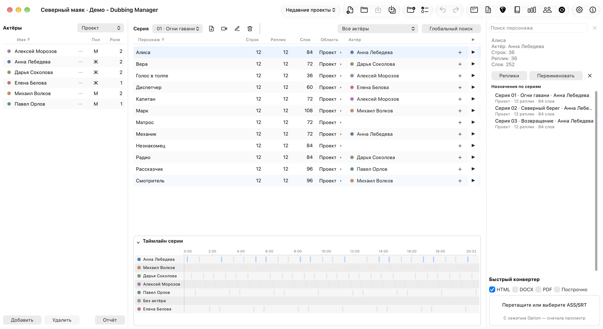
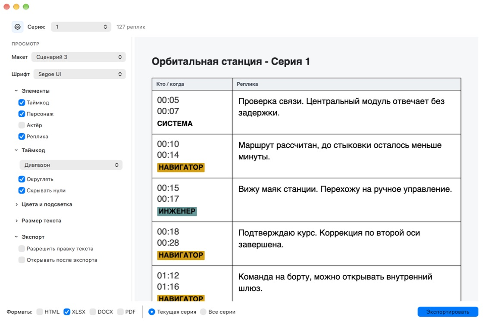
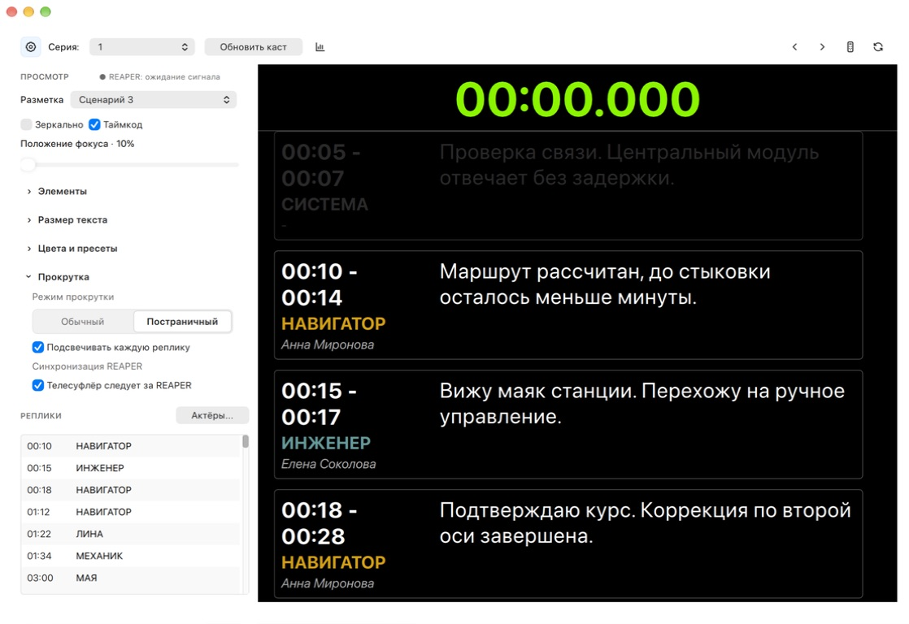
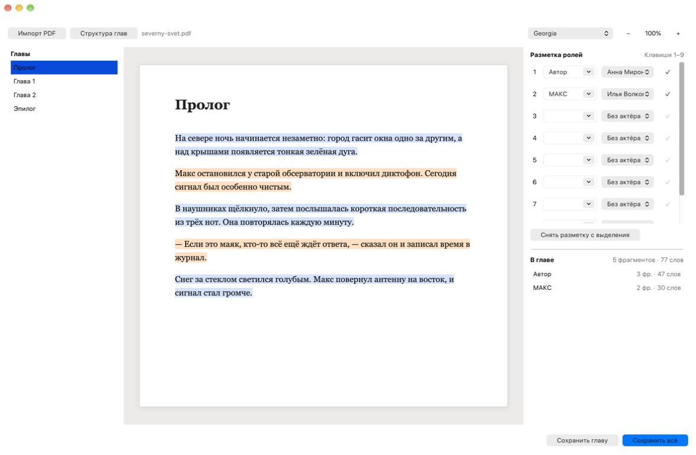

<p align="center">
  
</p>

<h1 align="center">Dubbing Manager 2.0.0</h1>

<p align="center">
  Сценарии, кастинг, запись и монтажные листы для дубляжа, закадрового озвучивания и аудиокниг.
</p>

<p align="center">
  <a href="https://github.com/ScrapDnB/DubbingManager/releases/tag/v2.0.0"><strong>Скачать 2.0.0</strong></a>
  · <a href="#быстрый-старт">Быстрый старт</a>
  · <a href="#переход-с-17-на-20">Переход с 1.7</a>
  · <a href="#запуск-из-исходников">Для разработчиков</a>
</p>

**Dubbing Manager** — настольное приложение для подготовки проектов озвучивания.
Оно связывает исходный сценарий, рабочий текст, персонажей, актёров, таймкоды и
видео: от импорта субтитров до телесуфлёра и проекта Reaper для записи.

Программа помогает режиссёру распределить роли, актёру получить свой текст,
звукорежиссёру подготовить сессию, а координатору оценить объём работы по сериям
и всему проекту. Основная работа с проектом выполняется локально; интернет
нужен для загрузки релизов и проверки обновлений.



*Главное окно на macOS. Демонстрационный проект «Северный маяк» использует
вымышленные имена, роли и реплики.*

## Содержание

- [Что нового в 2.0](#что-нового-в-20)
- [Скачать и установить](#скачать-и-установить)
- [Быстрый старт](#быстрый-старт)
- [Возможности](#возможности)
- [Работа с Reaper](#работа-с-reaper)
- [Форматы и хранение проекта](#форматы-и-хранение-проекта)
- [Переход с 1.7 на 2.0](#переход-с-17-на-20)
- [Сохранение и резервные копии](#сохранение-и-резервные-копии)
- [Горячие клавиши](#горячие-клавиши)
- [Частые вопросы](#частые-вопросы)
- [Запуск из исходников](#запуск-из-исходников)
- [Ветки и релизы](#ветки-и-релизы)

## Что нового в 2.0

- **Интерфейс Qt Quick/QML.** Переработанное рабочее пространство, нативная
  панель инструментов macOS, адаптивная компоновка и настройки таблиц.
- **Рабочий текст внутри `.dub`.** Исходные строки и правки сохраняются в
  проекте; правила объединения реплик можно менять, сохраняя внесённые правки.
- **Таймлайн серии.** Реплики на временной шкале, цвета актёров и переход к
  персонажам для проверки кастинга и распределения нагрузки.
- **Телесуфлёр.** Плавная прокрутка по таймкодам, постраничный режим, зеркальное
  отображение, плавающий контроллер и синхронизация с Reaper по OSC.
- **Аудиокниги.** Импорт текстового PDF, редактирование структуры глав, разметка
  ролями, проверка размеченного текста и экспорт PDF для чтения или студии.
- **Монтажные листы.** Настраиваемые макеты, профили оформления, визуальный
  конструктор шаблонов и предпросмотр с редактированием рабочего текста.
- **Сохранность проекта.** Undo/redo для поддерживаемых операций, атомарная
  запись, резервные копии и проверка структуры файлов.
- **Перенос проектов.** Относительные пути, диагностика связанных материалов
  и перепривязка исходников и видео после перемещения.
- **Доработки стабильного релиза.** Поиск актёров по нескольким частям имени,
  одинаковая обработка «е» и «ё», сохранение прокрутки предпросмотра при
  обновлении и защита текста от изменений при простой потере фокуса.

Подробности выпуска: [заметки к 2.0.0](RELEASE_NOTES.md).

## Скачать и установить

Готовые сборки находятся в [релизе 2.0.0](https://github.com/ScrapDnB/DubbingManager/releases/tag/v2.0.0).
Python и отдельная установка Qt для них не требуются. Интерфейс версии 2.0.0
доступен на русском языке.

| Платформа | Файл | Установка |
| --- | --- | --- |
| macOS 13 и новее | `Dubbing_Manager_macOS.dmg` | Откройте образ и перенесите `Dubbing Manager.app` в `Applications` |
| Windows | `Dubbing_Manager_Windows.zip` | Полностью распакуйте архив и запустите `Dubbing Manager.exe` из папки приложения |

### macOS

После установки запустите приложение из `Applications`. Проекты `.dub` и
резервные копии `.dub_backup` можно открывать двойным кликом.

Сборка использует ad-hoc подпись. Если macOS блокирует первый запуск, проверьте,
что файл скачан из этого репозитория, и разрешите открытие в системных настройках
**Конфиденциальность и безопасность**.

### Windows

Храните `.exe` вместе с остальным содержимым распакованной папки: сборка
использует поставляемые рядом библиотеки и ресурсы.

Для открытия проектов двойным кликом выполните в PowerShell из папки приложения:

```powershell
.\Register_DUB_File_Association.ps1
```

Скрипт регистрирует `.dub` и `.dub_backup` для текущего пользователя. Для удаления
ассоциаций используйте параметр `-Unregister`.

Обновления можно проверить в окне **О программе**. Все опубликованные версии
доступны в [GitHub Releases](https://github.com/ScrapDnB/DubbingManager/releases).

## Быстрый старт

### Дубляж или закадровое озвучивание

1. Создайте новый проект и задайте его название в настройках проекта.
2. Сохраните проект как `.dub` в рабочую папку.
3. Импортируйте сценарий `.ass`, `.srt` или `.docx`. Проверьте параметры импорта;
   для DOCX сопоставьте колонки таблицы с таймкодами, персонажами и текстом.
4. Добавьте актёров в проект вручную или перенесите из глобальной базы.
5. Назначьте актёров персонажам. Выберите область назначения: весь проект или
   только текущая серия.
6. Проверьте неназначенные роли, объём текста и таймлайн; при необходимости
   привяжите видео к серии.
7. Откройте **Монтажный лист**, настройте макет и экспортируйте материалы.
   Для записи используйте **Телесуфлёр** или **Экспорт в Reaper**.

Для следующей серии импортируйте новый сценарий в тот же проект: общие назначения
ролей будут использоваться повторно, а исключения можно задать на уровне серии.

### Аудиокнига

1. Создайте и сохраните отдельный проект, затем откройте **Аудиокнига**.
2. Нажмите **Импорт PDF** и выберите книгу с текстовым слоем.
3. Проверьте найденные главы в **Структуре глав** и исправьте границы и названия.
4. Добавьте актёров, подготовьте роли и назначьте часто используемые роли слотам 1–9.
5. Выделяйте фрагменты текста и применяйте нужную роль; проверьте результат
   разметки и распределение текста между исполнителями.
6. Сохраните изменения главы или всей книги. Через **Экспорт PDF** выберите главы,
   общий файл или отдельные файлы и макет для чтения либо студийной записи.
7. Сохраните `.dub`, чтобы продолжить работу с текстом, главами и кастингом позже.

PDF-сканы без текстового слоя требуют предварительного OCR. Распознавание
изображений страниц в Dubbing Manager не входит.

## Возможности

### Сценарии и серии

- Импорт ASS, SRT и табличных DOCX с настройкой распознавания данных.
- Несколько серий в проекте, переименование и удаление серий.
- Объединение исходных строк в рабочие реплики по правилам импорта и тайминга.
- Правки рабочего текста без обязательной перезаписи исходного сценария.
- Поиск по проекту с переходом к найденной серии и персонажу.
- Видео серии и просмотр реплик по таймкоду.
- Быстрый конвертер ASS/SRT для подготовки листов без полноценного проекта.
- Перетаскивание проектов и сценариев в главное окно.

### Актёры и распределение ролей

- Проектная и глобальная базы актёров, цветовая маркировка и пол.
- Поиск в глобальной базе по частям имени, независимо от регистра и «е»/«ё».
- Один или несколько актёров на роль, общие назначения и исключения по сериям.
- Массовое назначение и перенос кастинга между проектами.
- Фильтры по актёру, персонажу и неназначенным ролям.
- Статистика реплик, колец и слов; просмотр появления роли по сериям.
- Настройка порядка, ширины и видимости колонок основной таблицы.

### Телесуфлёр и запись

- Несколько сценарных макетов и фильтрация по исполнителям.
- Настройка шрифтов, размеров, цветов, таймкодов и подсветки.
- Ручная навигация, плавная прокрутка и постраничный режим.
- Зеркальное отображение для аппаратного телесуфлёра.
- Плавающее окно управления и работа с отдельным экраном.
- Приём позиции и состояния воспроизведения Reaper по OSC, отправка навигации
  при включённой исходящей синхронизации.
- Настраиваемое смещение времени относительно Reaper.

### Монтажные листы и отчёты

- Табличные и сценарные макеты с живым предпросмотром.
- Настройка колонок, оформления, цветовой маркировки и формата таймкода.
- Редактирование текста в предпросмотре с сохранением правок в рабочем тексте.
- Визуальный конструктор и библиотека шаблонов.
- Экспорт одной серии или всего проекта в HTML, XLSX, DOCX и PDF.
- Отчёт по серии, сводка проекта и данные для переноса в Google Sheets.
- Экспорт Reaper `.rpp` и CSV-маркеров.

### Аудиокниги

- Извлечение текста PDF и первоначальное выделение глав.
- Редактор структуры глав и книжный вид текста.
- Разметка фрагментов ролями с цветами назначенных актёров.
- Быстрые слоты ролей 1–9 и проверка разметки.
- Сохранение структуры и текста книги в проекте.
- PDF по выбранным главам, единым документом или отдельными файлами.

<table>
  <tr>
    <td width="50%"></td>
    <td width="50%"></td>
  </tr>
  <tr>
    <td align="center">Предпросмотр монтажного листа</td>
    <td align="center">Телесуфлёр для записи</td>
  </tr>
</table>



*Дополнительные иллюстрации показывают инструменты линейки 2.0; их внешний вид
зависит от платформы и настроек.*

## Работа с Reaper

### Подготовка сессии

Откройте **Экспорт в Reaper**, проверьте параметры и сохраните `.rpp`. В зависимости
от выбранных настроек сессия содержит треки актёров, регионы реплик и связанное
видео. Маркеры можно сохранить отдельно в `.csv`. Экспорт доступен для текущей
серии и серий проекта.

### Синхронизация телесуфлёра по OSC

Для работы на одном компьютере используются следующие значения по умолчанию:

| Направление | Настройка Dubbing Manager | Настройка Reaper |
| --- | --- | --- |
| Reaper → Dubbing Manager | Принимает: `8000` | Device port: `8000` |
| Dubbing Manager → Reaper | Отправляет: `9000` | Local listen port: `9000` |
| Адрес Reaper | `127.0.0.1` | Device IP: `127.0.0.1` |

1. В Reaper откройте **Options → Preferences → Control/OSC/Web**.
2. Нажмите **Add** и выберите **OSC (Open Sound Control)**.
3. Укажите IP и порты из таблицы; оставьте `Default.ReaperOSC` в Pattern config.
4. В настройках Dubbing Manager откройте раздел **Reaper / OSC** и включите OSC.
5. Включите приём синхронизации; отправку включайте, если навигация телесуфлёра
   должна перемещать курсор Reaper.
6. Откройте телесуфлёр и проверьте движение по таймкоду при воспроизведении.

Порты можно изменить, сохранив соответствие в обеих программах. Если соединения
нет, проверьте адрес, занятость UDP-портов и разрешения межсетевого экрана.

## Форматы и хранение проекта

| Назначение | Форматы |
| --- | --- |
| Входные сценарии | `.ass`, `.srt`, табличный `.docx` |
| Входная книга | `.pdf` с текстовым слоем |
| Проект | `.dub` |
| Резервная копия | `.dub_backup` |
| Импорт старого проекта | legacy `.json`, старые `.dub` |
| Связанное видео | `.mp4`, `.mkv`, `.avi`, `.mov`, `.m4v`, `.wmv` |
| Монтажные листы | `.html`, `.xlsx`, `.docx`, `.pdf` |
| Размеченная аудиокнига | `.pdf` |
| Сессия и маркеры Reaper | `.rpp`, `.csv` |

Проект 2.0 хранит кастинг, настройки, исходные строки и правки рабочего текста,
а для аудиокниги — структуру глав и размеченный текст. Видео остаётся внешним
файлом; `.dub` не является архивом всех медиафайлов.

Рабочие тексты, уже сохранённые внутри проекта, доступны без исходного сценария.
Для повторного импорта и других операций с исходниками сохраните оригинальные
ASS/SRT/DOCX/PDF. После перемещения папки откройте **Файлы проекта**, проверьте
состояние связей и перепривяжите отсутствующие материалы.

## Переход с 1.7 на 2.0

Версия приложения — **2.0.0**, версия формата проекта — **2.0**.

1. Сделайте копию проекта 1.7 и связанных исходников.
2. Откройте старый `.dub` или `.json` в Dubbing Manager 2.0.0.
3. Проверьте серии, назначения актёров, рабочий текст и пути к видео.
4. Сохраните результат под новым именем `.dub`, оставив исходную копию для 1.7.

Проекты, сохранённые в формате 2.0, не предназначены для открытия в 1.x.
Предварительный экспериментальный формат аудиокниг не поддерживается: для таких
файлов потребуется повторный импорт PDF.

Исходники версии 1.7.1 сохранены в ветке
[`legacy/1.7`](https://github.com/ScrapDnB/DubbingManager/tree/legacy/1.7), а готовая
сборка — в [релизе 1.7.1](https://github.com/ScrapDnB/DubbingManager/releases/tag/v1.7.1).

## Сохранение и резервные копии

Ручное сохранение записывает проект атомарно. Автоматические резервные копии
содержат снимок проекта в `.dub_backup`; их параметры находятся в глобальных
настройках:

- включение резервных копий и интервал;
- папка рядом с проектом или отдельный абсолютный путь;
- максимальное количество сохраняемых копий.

Используйте встроенный просмотр резервных копий для выбора и восстановления
нужного состояния. Видео и другие внешние материалы копируйте отдельно вместе
с рабочей папкой.

## Горячие клавиши

| Действие | Windows | macOS |
| --- | --- | --- |
| Новый проект | `Ctrl+N` | `⌘N` |
| Открыть проект | `Ctrl+O` | `⌘O` |
| Сохранить | `Ctrl+S` | `⌘S` |
| Сохранить как | `Ctrl+Shift+S` | `⇧⌘S` |
| Отменить | `Ctrl+Z` | `⌘Z` |
| Повторить | `Ctrl+Y` | `⇧⌘Z` |
| Предыдущая / следующая реплика телесуфлёра | `←` / `→` | `←` / `→` |

Клавиши навигации телесуфлёра можно изменить в его настройках. В редакторе
аудиокниги используются слоты ролей 1–9; действие применяется к выделенному тексту.

## Частые вопросы

**Почему DOCX не импортируется как сценарий?**

Импорт рассчитан на таблицы. Проверьте сопоставление колонок и наличие таймкодов,
имён персонажей и текста в выбранных столбцах.

**Почему в книге нет текста или неверно выделены главы?**

Проверьте наличие текстового слоя PDF. Для сканов сначала выполните OCR; границы
и названия глав можно исправить в редакторе структуры.

**Как исправить потерянные файлы после переноса проекта?**

Откройте **Файлы проекта** и задайте актуальные пути. Для переноса на другой
компьютер копируйте `.dub` вместе с исходниками и видео.

**Можно ли работать без Reaper?**

Да. Импорт, кастинг, отчёты, монтажные листы, аудиокниги и ручная навигация
телесуфлёра работают независимо от Reaper.

**Есть ли готовая сборка для Linux?**

Релизный workflow выпускает macOS и Windows. Запуск из исходников на другой
платформе зависит от доступности зависимостей и отдельно не проверяется в CI.

## Запуск из исходников

Релизные сборки и CI используют **Python 3.14**, **PySide6 6.10.2** и
**PyInstaller 6.20.0**. Зависимости перечислены в [requirements.txt](requirements.txt).

```bash
git clone https://github.com/ScrapDnB/DubbingManager.git
cd DubbingManager
git checkout master
python3 -m venv .venv
source .venv/bin/activate
python -m pip install --upgrade pip
python -m pip install -r requirements.txt
python qml_main.py
```

В Windows после создания окружения:

```powershell
.\.venv\Scripts\Activate.ps1
python -m pip install --upgrade pip
python -m pip install -r requirements.txt
python qml_main.py
```

Для воспроизведения именно релиза 2.0.0 выберите `git checkout v2.0.0` перед
установкой зависимостей. Для открытия конкретного проекта:

```bash
python qml_main.py /path/to/project.dub
```

### Проверки и сборка

```bash
python -m pytest -q
python scripts/lint_qml.py
python -m PyInstaller dubbing_manager.spec --clean
```

В CI тесты Qt выполняются с `QT_QPA_PLATFORM=offscreen`. Полный набор проверяет
сервисы, формат проекта, совместимость, экспорт, QML backend, телесуфлёр и
межпроцессное открытие проектов.

Готовые артефакты собираются на соответствующей ОС. Подробности упаковки,
подписи macOS и публикации находятся в [.github/BUILD.md](.github/BUILD.md).
Архитектура описана в [STRUCTURE.md](STRUCTURE.md):

| Каталог / файл | Назначение |
| --- | --- |
| `qml_main.py` | Запуск приложения |
| `qml/` | Главное окно, диалоги и компоненты Qt Quick |
| `ui/qml_backend/` | Модели и связующий слой QML |
| `services/` | Импорт, хранение, экспорт и прикладные сервисы |
| `core/` | Модели, команды и история изменений |
| `application/` | Контроллеры прикладных сценариев |
| `tests/` | Автоматические проверки |

## Ветки и релизы

- **`master`** — основная ветка приложения 2.x после переноса QML.
- **`legacy/1.7`** — сохранённая история версии 1.7 на коммите релиза 1.7.1.
- **`QML`** — ветка разработки нового интерфейса, интегрированная в `master`
  при подготовке 2.0.0.
- **`v2.0.0`** — тег стабильного релиза. Теги с суффиксом `-beta` или `-rc`
  обозначают предварительные версии.

## Обратная связь

Сообщайте о проблемах через [GitHub Issues](https://github.com/ScrapDnB/DubbingManager/issues).
Укажите версию программы, ОС, шаги воспроизведения и ожидаемый результат.
По возможности приложите обезличенный пример сценария или проекта.

Сведения об используемых сторонних компонентах:
[THIRD_PARTY_NOTICES.md](THIRD_PARTY_NOTICES.md).

<p align="center">© 2026 Юрий Романов</p>
